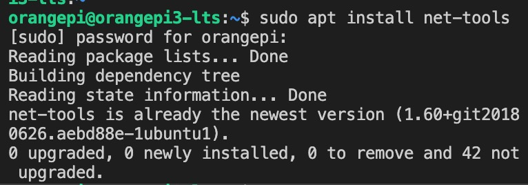
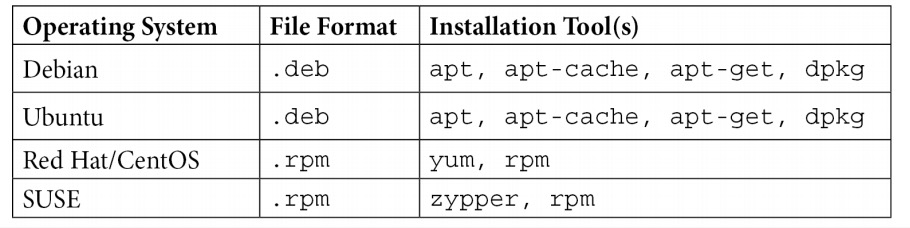
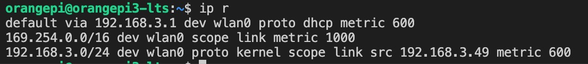

# Chapter 2: Basic Linux Network Configuration and Operations - Working with Local Interface

主要内容:
- 本章将会讲解本地接口和路由的展示和配置
- 展示和修改 IP 地址, 本地路由, 接口常见参数
- 给接口分配IP地址

# net-tools
大部分人熟悉的是ifconfig(interface config)和相关的命令

1. 安装`sudo apt install net-tools`

常见系统的安装工具总结:

# ip address
- 缩略版: ip ad
- 展示接口的信息, DHCP、IPv6
- 只展示IPv4: `ip -4 ad`

# ifconfig
- 展示接口的状态

# ip route
- 展示路由信息
- 缩略版: `ip r`
- 组成部分: 默认网关、本地部分和自己子网本身
- 如果包发向的指定地址不在路由表中，主机会把这个包发向默认的网关
- 如果一个主机没有配置静态IP地址，并且DHCP没有分配地址，它会自动获取(169.254)开头的IP地址

- 可以看到有个默认的路由指向192.168.3.1(网关)
- 169.254.0.0/16是本地IP地址
- 192.168.3.0/24是连接路由

# netstat
- 查看网络状态: netstat -rn
- route本身也是一个命令, route -n

# 分配IP地址-nmcli(Network Manager Command Line)
- 展示网络连接信息: sudo nmcli connection show

注意

- 如果提示找不到文件，首先考虑源的问题
  - 查看文件内容: cat /etc/apt/sources.list
  - 添加新的源: echo deb http://archive.ubuntu.com/ubuntu quantal universe >> /etc/apt/sources.list
  - 升级: sudo apt-get update
  - 再次安装: sudo apt install network-manager

- 修改ipv4: sudo nmcli connection modify "Wired connection 1" ipv4.addresses 192.168.122.22/24
- 修改gateway: sudo nmcli connection modify "Wired connection 1" ipv4.gateway 192.168.122.1
- 修改dns: sudo nmcli connection modify "Wired connection 1" ipv4.dns "8.8.8.8"
- 启动: sudo nmcli connection up "Wired connection 1" 

- 修改dns可以编辑文件`/etc/resolv.conf`内的nameserver
- 更改IP地址、子网掩码，可以编辑文件`/etc/sysctl.conf`

# 新增路由 - route
- 主要是为了新增静态路由
- 假如我们要经过`192.168.122.10`去获取`10.10.10.0/24`的网络: sudo ip route add 10.10.10.0/24 via 192.168.122.10
- 此类添加只是临时添加,如果重启或者服务的进程重启,新增就会失效
- 需要永久添加则需要`nmcli`指令
  - sudo nmcli con show
  - sudo nmcli con mod "Wired connection 1" +ipv4.routes "10.10.11.0/24 192.168.122.11"
  - 重新启动服务: sudo nmcli con up "Wired connection 1"
  - 查看结果: `ip route`
  - 新增路由: `sudo route add -net 10.10.12.0 netmask 255.255.255.0 gw 192.168.122.12`

