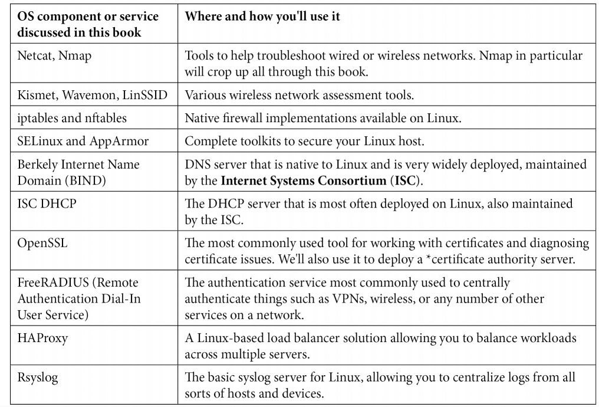

# Preface

本书适合于:
- 网络基础设施的管理员
- 防范网络安全攻击
- 定制化配置Linux服务

内容范围:
1. 第一章讲解Linux的历史。
2. 第二张讲解基础Linux网络的配置和操作。
   1. 本地接口和网络接口配置。
   2. 如何配置不同网络接口参数。
   3. IP and MAC层的基础知识。
3. 使用Linux和Linx工具诊断网络。
4. 防火墙。
5. Linux安全标准。
6. DNS服务。
   1. DNS的运行。
   2. 如何实现DNS服务。
   3. 防范DNS攻击。
7. DHCP服务。
   1. VoIP
8. 证书服务。 - 常被看做是`bogeyman`(妖怪)
9. Radius认证服务。
10. 负载均衡服务(Load Balance)。
11. 数据包捕获和分析。
12. 网络监控。
13. 入侵防御系统。
14. Honeypot服务。

本书需要条件:
- Ubuntu 20 or newer
- 所需service总结

