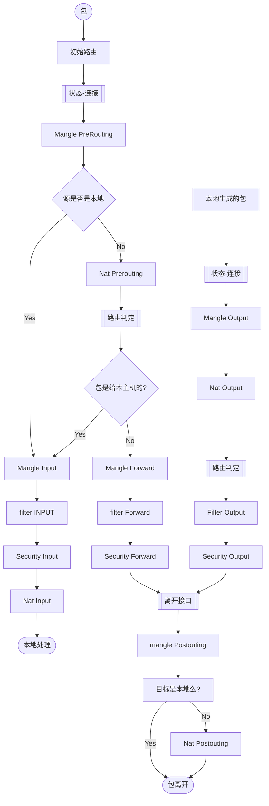

# Section 2. Linux 作为网络节点和问题解决平台

本部分内容:
- Linux host
- 网络诊断和解决
- 防火墙
- 安全
- 方法、监管框架、强化指南、框架

# Chapter 3 Using Linux and Linux Tools for Network Diagnostics

本章会讲解一些如何工作的网络基础。
- OSI
- 第2层, 使用ARP连接IP地址和MAC，以及一些详细的MAC数据
- 第4层, TCP-UDP 的端口是如何工作的, TCP的三次握手, 和如何在Linux里出现的
- 本地TCP和UDP端口枚举, 和运行服务的关系
- 使用两种本地端口实现远程枚举

# 常见工具的总结
|对象|功能描述|
|---|---|
|arp|关联物理MAC地址和IP地址|
|netplan|基于Yaml的网络设置配置工具|
|ip and ifconfig|展示本地主机的网络接口的参数|
|netstat and ss|查看本地主机额度TCP/UDP监听端口, 以及关联的进程. 也可以用来观察TCP的状态变化|
|telnet|非常不好的工具|
|nc(Netcat)|在远程服务上，常被用来连接和细查. 也可以测试本机上的本机服务|
|Nmap|枚举和测试远程主机的监听端口,也可以对这些端口执行脚本|
|Kismet|查看未连接的无线网络详情|
|Wavemon|查看已连接的无线网络详情, 尤其是在信号增强和性能相关上|
|LinSSID|Kismet的图形化工具，擅长挖掘在周围无线网络中的信号强度和信道利用率|

# ARP
- ARP请求会在每个主机上储存缓存。缓存区叫做ARP cahce / ARP table。
- `arp -a`
- 查看`arp`的过时时间: `cat /proc/sys//net/ipv4/neigh/default/gc_stale_time`
- 修改`mac ip`: `arp -s 192.168.122.200 00:11:22:22:33:33`
- 删除: `arp -i ens33 -d 192.168.122.200`
- 伪装成给定的ip地址, 比如10.0.0.1的ARP应答: `sudo arp -i eth0 -Ds 10.0.0.2 eth1 pub`

- 查找MAC地址的四种办法：
    - ip link show | grep link
    - ifconfig
- 设置：
```shell
$ sudo ip link set dev ens33 down
$ sudo ip link set dev ens33 address 00:88:77:66:55:44
$ sudo ip link set dev ens33 device here> up
```
# TCP/UDP端口工作
|名字|端口|
|---|---|
|DNS| udp/53, tcp/53|
|Telnet|tcp/23|
|SSH|tcp/22|
|FTP|tcp/20 and tcp/21|
|HTTP|tcp/80|
|HTTPS|tcp/443|
|SNMP|udp/162|
|Syslog|tcp/443|

## 监听端口变化
netstat是个常用的传统工具，可以获取网络变化的状态。以下为常用的参数:
- t: TCP ports
- u: UDP ports
- a: 所有端口，包含监听和没有监听在内
- n: 不对指定的ip进行解析。如果为空，则解析列表中的每个ip

- `netstat -tuan`
### netstat连接的状态描述
|状态|描述|
|---|---|
|LISTEN|表明这是主机正在运行的进程，且在监听此端口，等待其他去连接它|
|ESTABLISHED|既可能是作为远程服务器客户端的本地进程, 也可能是作为本地服务客户端的远程主机。 如果是熟悉的端口，则服务是本地的。如果端口在外部的地址上，则那是外部的服务器，本地只是客户。 如果端口不是常见的，从LISTEN的列表中查看是否存在该端口，如果存在，则表明本地是远程客户端的服务器。在三次握手后，TCP session会建立，同时变成当前到状态，客户和在服务器准备好交流。|
|TIME_WAIT|表明session已经关闭，但仍在等待回传的包。换句话说，则是客户或者服务器已经发送了FIN包，但还在等待响应。|
|SYN_SENT|客户机发送了TCP的SYN包，正在等待响应。这个转变时间很快。|
|SYN_RECV|服务器收到了客户机发来的SYN包，然后响应SYN-ACK包。|
|FIN_WAIT1 and 2|会话和连接正在被关闭。客户机或者服务器正在等待从对方发回来的FIN包。|
|CLOSE|关闭|
|CLOSE_WAIT|正在等待应用关闭套接字。|
|LAST_ACK|session几乎已经关闭，正在等待最终的ACK包去结束。|
|CLOSING|双方套接字都已经关闭。|

`netstat -tulpn`
- t: TCP ports
- u: UDP ports
- a: Both directions("all")
相应的命令有: `ss  -tuap`
处理数据格式:
```shell
sudo ss -tuap  | tr -s ' ' | cut -d ' ' -f 1,2,4,5,6 --output-delimiter=$'\t'
```

- 查看更详细的TCP会话统计:`ss -to`
- 查看端口的使用情况: `lsof -i :443`

## nc(netcat) 扫描端口
- 扫描端口: nc -zv 192.168.122.241 80
- 扫描多个端口： nc -zv 192.168.122.241 1-1024
- 过滤扫描结果: `nc -zv 192.168.122.241 1-1024 | grep -v refused`

## Linux的0/1/2三者的意义
|名字|代表|
|---|---|
|STDIN|0|
|STDOUT|1|
|STDERR|2|

- 重定向STDERR到STDOUT: `sudo nc -zv -w2 192.168.3.5 1-1024 2>&1 | grep -v refused`

- 查看udp扫描端口的耗时: `date ; nc -u -zv 192.168.3.5 1-1024 2>&1 | grep succeed ; date`
- 连接`web`服务器：`nc 192.168.3.5 80`
- 监听端口，伪造虚拟主机:`while true; do cat index.html | nc -w2 -l 80 ; done`
- 测试打印时间:`while true; do echo -e "HTTP/1.1 200 OK\n\n ${date}" | nc -l 1500 -w2; done`

# Nmap
- 扫描网络资源
- 本质是使用SYN扫描。每次送出一个SYN包，然后等待SYN-ACK包的返回。如果没有获取，则认为是关闭的。
- 扫描网段：`nmap -sn 192.168.122.0/24`
- 查询tcp/443运行的机器: `nmap -p 443 -open 192.168.122.0/24`
- 如果想全链接扫描（完整完成了三次握手）,加上`-sT`
- 扫描udp端口: `nmap -sU -p 53 --open 192.168.3.0/24`

# 无线网络诊断
- 工具: Kismet / Wavemon / LinSSID

# 防火墙
|名字|描述|
|---|---|
|iptables|控制iptables防火墙的主要命令|
|nft|控制新的nftables防火墙|

## iptables
Linux默认防火墙应用。
- 启用后，会控制主机的所有进出口
- 有一组规则链

行为:
- Accept: 包通过
- Drop: 包被丢弃，不允许通过
- Return: 阻止包通过，并返回上一条规则链

filter表:
- Input: 控制进入主机的包
- Forward: 处理转发到他处的传入包
- Output: 处理离开主机的包

表结构:
```shell
Chain INPUT (policy ACCEPT 0 packets, 0 bytes)
 pkts bytes target     prot opt in     out     source               destination         

Chain FORWARD (policy ACCEPT 0 packets, 0 bytes)
 pkts bytes target     prot opt in     out     source               destination         

Chain OUTPUT (policy ACCEPT 0 packets, 0 bytes)
 pkts bytes target     prot opt in     out     source               destination    
```

- 还有NAT表和Mangle表。
- 查看默认的规则链: `iptables -L -v`

参数说明:
- A: 指定规则表
- I: 应用到哪个接口
- p(protocol): 区分TCP/UDP/ICMP，也可以使用`all`
- s(source): 源主机的主机名或者ip地址
- dport(destination port): 常见的端口, 如TCP: SSH(22),HTTPS(443)。如果在多个网络中运行，常见此条命令。
- j(target): 目标的名字: ACCEPT/DROP/RETURN, 此参数是必须的

- 允许1.2.3.0/24的主机连接我们主机的tcp/22， 而允许其他的所有主机连接到tcp/443：
```shell
sudo iptables -A INPUT -i ens33 -p tcp -s 1.2.3.0/24 --dport 22 -j ACCEPT

sudo iptables -A INPUT -p tcp --dport 443 -j ACCEPT
```
- --line-numbers: 找出该条规则的行号,再通过行号删除规则
- I: 在制定的位置插入规则
- A: 在列表最后添加

拒绝https访问，但是允许其他的所有:
```shell
sudo iptables -I INPUT 2 -i ens33 -p tcp -s 1.2.3.5. --dport 443 -j DROP
```
- --src-range 192.168.122.10-192.168.122.20: 控制能够访问的ip段和访问权限
    - 此办法也可以封禁其他的网络利用`SSH`登陆, 只允许自己指定的网段登陆
```shell
sudo iptables -I INPUT 2 -i ens33 -p tcp --dport 22 -j DROP
```
- 删除指定行的规则: `sudo iptables -D INPUT [number]`
- j LOG: 开启日志
- -log-level: 日志的等级
- -log-prefix 'text goes here': 描述文本

日志的功能：
- 登陆ssh会话，允许我们追踪来访者，防止被人扫描主机的管理服务
- 寻找那些不在被允许范围内、尝试连接的人
- 和web日志结合，去查看具体的问题
 
- 写日志: `sudo iptables -A INPUT -j LOG`
- 只在指定子网写日志: `sudo iptables -A INPUT -s 192.168.122.0/24 -j LOG`
- 增加日志的等级和描述日志: `sudo iptables -A INPUT -s 192.168.122.0/24 -j LOG --log-level 3 -log-prefix '* SUSPECT TRAFIIC RULE 9*'`
- 日志的位置: 
    - Ubuntu: `/var/log/kern.log`
    - RedHat: `/var/log/messages`
- 规则加备注(-m comment --comment "TEXT"): `sudo iptables -A INPUT -i enss3 -p tcp -s 1.2.3.0/24 --dport 22 -j ACCEPT -m comment --comment "Permit Admin"`

- 更改规则链的默认值: `iptables -P INPUT DENY`or `ACCEPT`

- 上述的所有规则只会储存在内存中，如果机器重启则会丢失。如果要保存，需要使用`iptables-save`命令

## NAT table
NAT常用来转换ip和子网。

- 如果NAT table入口是针对TCP的会话，则在TCP关闭后移出这个映射。
- 如果NAT table入口是UDP，则在一度时间的不活跃后删除。

- 查看Nat table: `sudo iptables -L -v -t nat`
```shell
Chain PREROUTING (policy ACCEPT 0 packets, 0 bytes)
 pkts bytes target     prot opt in     out     source               destination         

Chain INPUT (policy ACCEPT 0 packets, 0 bytes)
 pkts bytes target     prot opt in     out     source               destination         

Chain OUTPUT (policy ACCEPT 0 packets, 0 bytes)
 pkts bytes target     prot opt in     out     source               destination         

Chain POSTROUTING (policy ACCEPT 0 packets, 0 bytes)
 pkts bytes target     prot opt in     out     source               destination        
```

- 告诉网关伪装所有离开eth1接口的IP地址: `sudo iptables -t nat -A POSTOUTING -o eth1 -j MASQUERADE`

## Mangle table
常用于手动调整IP包传输的值。
- DSL会封装，卫星链路会小一些。
- 当遇到SYN包时，调整MSS（最大片元大小）为更小(1412): `iptables -t mangle -A FORWARD -p tcp --tcp-flags SYN,RST SYN -j TCPMSS --set-mss 1412`
    - 测试: `ping -M do -s 1400 [ip]`

## iptables执行的顺序


## nftables
